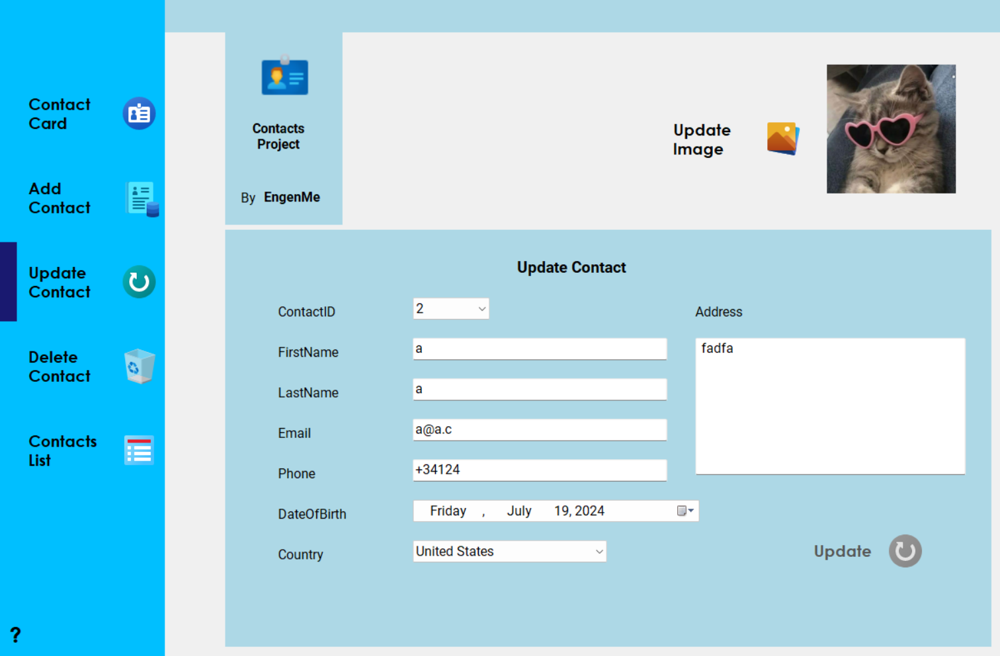
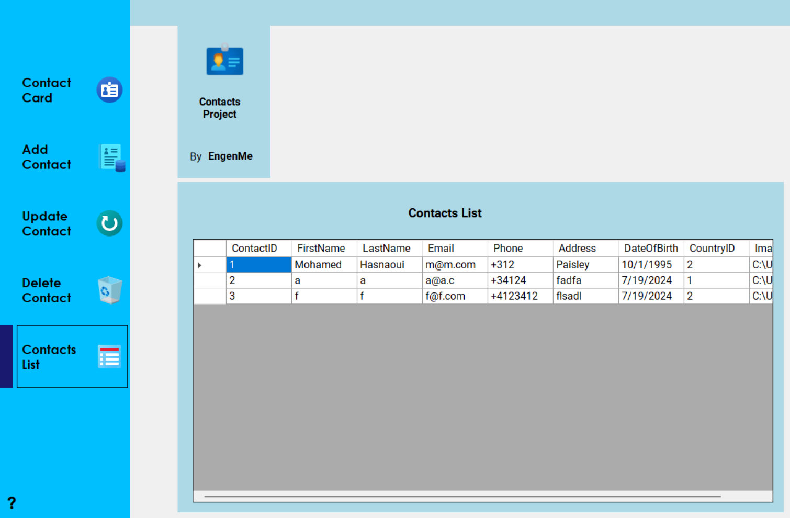

# Contact Management System

## Overview

The Contact Management System is a C# application that provides a basic framework for managing contact and country information. It utilizes ADO.NET to interact with a SQL Server database, allowing for CRUD (Create, Read, Update, Delete) operations on contact and country records.

<div>
  
  
</div>

## Project Structure

- `DataAccessLayer/`
  - `clsServerInfo.cs`: Contains the server connection string.
  - `stContact.cs`: Defines the `stContact` structure representing a contact.
  - `stCountry.cs`: Defines the `stCountry` structure representing a country.
  - `clsContactDB.cs`: Provides methods for CRUD operations on contact records.
  - `clsCountryDB.cs`: Provides methods for CRUD operations on country records.
  - `clsDataAccessLayer.cs`: An empty class placeholder for future data access methods.

## Getting Started

To use this project, you need to set up a SQL Server database and configure the connection string.

### Prerequisites

- .NET Framework (version compatible with your development environment)
- SQL Server (or another compatible database server)

### Setup

1. **Clone the Repository**

```bash
git clone https://github.com/EngenMe/contact-management-system.git
cd contact-management-system
```

2. **Configure the Connection String**

Open the `clsServerInfo.cs` file and update the `ConnectionString` to match your SQL Server configuration:

```bash
public static string ConnectionString = "Server=.;Database=DB_Contacts;User Id=sa;Password=sa123456;";
```

Ensure the database named `DB_Contacts` exists, or create it with the appropriate schema.

3. **Build and Run**

Open the solution in Visual Studio (or another C# IDE), build the project, and run it. You can now interact with the database through the provided classes.

## Usage

### `clsContactDB` Methods

- `GetLineRecord(int ContactID)`: Retrieves a contact by its ID.
- `AddRecordToContactDB(stContact NewContact)`: Adds a new contact to the database.
- `UpdateRecordInContactDB(int ContactID, stContact NewContact)`: Updates an existing contact record.
- `DeleteRecordInContactDB(int ContactID)`: Deletes a contact record.
- `GetAllContactIDs()`: Gets a list of all contact IDs.
- `GetAllContactsFromContactsDB()`: Retrieves a DataTable with all contact records.
- `IsContactExist(int ContactID)`: Checks if a contact exists by ID.
- `IsContactExist(stContact Contact)`: Checks if a contact exists based on the provided contact information.

### `clsCountryDB` Methods

- `GetLineRecord(int CountryID)`: Retrieves a country by its ID.
- `GetLineRecord(string CountryName)`: Retrieves a country by its name.
- `AddRecordToCountryDB(stCountry NewCountry)`: Adds a new country to the database.
- `UpdateRecordInCountryDB(int CountryID, stCountry NewCountry)`: Updates an existing country record.
- `DeleteRecordInCountryDB(int CountryID)`: Deletes a country record.
- `GetAllCountryIDs()`: Gets a list of all country IDs.
- `GetAllCountryNames()`: Retrieves a list of all country names.
- `GetAllCountriesFromCountriesDB()`: Retrieves a DataTable with all country records.
- `IsCountryExist(int CountryID)`: Checks if a country exists by ID.

## Contributing

Feel free to fork the repository and submit pull requests for any improvements or bug fixes.

## License

This project is licensed under the MIT License - see the **`[LICENSE](LICENSE)`** file for details.

## Acknowledgments

**`[ADO.NET Documentation](https://docs.microsoft.com/en-us/dotnet/framework/data/adonet/)`**
**`[SQL Server Documentation](https://docs.microsoft.com/en-us/sql/sql-server/)`**
